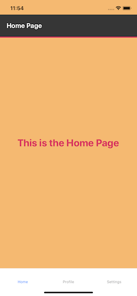

### Usage

1. Set up your development environment by following the steps in React Native Docs (link below):
https://reactnative.dev/docs/environment-setup

2. run yarn install or npm install 

3. run yarn ios or yarn android (depending on which device you want to use)

### Demo

 <!-- .element width="10px" -->